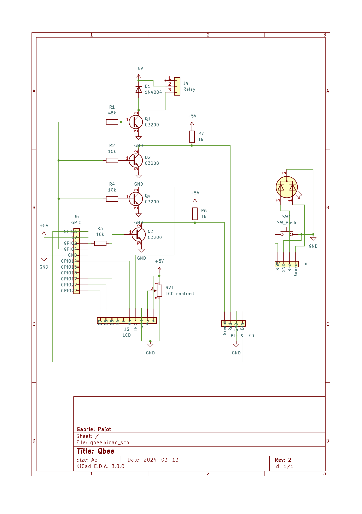

# A bit about the hardware I used

I am using the first Hifiberry DAC on a Raspberry Pi 1.
I have added a small circuit to control the amplifier relay and a couple of status LEDs
as well as a push button to turn off the Pi or start it.

## Setting up Hifiberry DAC

Edit `/boot/config.txt` to add:
```
dtparam=audio=on
dtoverlay=hifiberry-dac
```

To disable the built-in sound card, edit `/etc/modprobe.d/raspi-blacklist.conf` to add:
```
blacklist snd_bcm2835
```

Edit `/etc/asound.conf` to set the default sound card for alsa, add:
```
defaults.pcm.card 0
defaults.ctl.card 0
```

## Disable Pi GPU

This should help give more power to the CPU, useful for older Pis.
Edit `/boot/config.txt` and add:
```
gpu_mem=16
disable_l2cache=0  # For pi 1 only
gpu_freq=250
```

## Circuit schematic



Most of the GPIOs are used to control the LCD.
GPIO 3 is used for a one-button start and stop (add `dtoverlay=gpio-shutdown` in `/boot/config.txt`).
2 more GPIOs are used to trigger 4 NPN transistors (to limit power drawn on the GPIO and allow using a higher voltage):
- the amp relay (Q1)
- the red standby LED (Q2, *not* gate)
- the green on LED (Q3, *not* gate)
- the LCD backlight (Q4)

The reason the LEDs are after a *not* gate is to be able to use GND as the same common for both (I used a dual AKA LED).
It also allows having both LED turned on when the Pi is off or restarting (gives a yellowish color).

Here is a [simulated version](https://www.falstad.com/circuit/circuitjs.html?ctz=CQAgjCAMB0l3BWEBmAHAJmgdgGzoRmACzICcpkORICkNIJNApgLRhgBQALisjiOlSoGqOoOF0IMBAnI5aRdkUgIi6LFGg4yyFXFJh0hnGFIM4IACZMAZgEMArgBsuHAE69+4z+FLoo4PCQHABuIKJ0CILhFnwSAcr0dMnQCBxgeDRE1NnCqtQIhgJWto4uLE5MlgFSmpCcHkSiAug5zer+kvAcAO4idMh8WdSD-MEZ-vkCWJPZPv7W9s5cFVXgASn16VjCOJDCGTRFh-xS0J2wRqhYYKKkaKhEMpkwKoFBm-7om2BIr2+caqFfzNPbCdolJYubg+Uj8RT8OE1EAsZDQIQzerIX5YZQGBDITQ4LAEvBEUg7HB+Aw5CyLMquDyjEBI5mmTr9ODuHzslCPXwcsBBGFoai8kj+XmSTQIPZNSCDPikWiyonoUhCVBgLCjQTIIzmOj05bchC4cDm+UWsbvcaZYmS81m07mhalZararSn4cAAeNAoAgsOBDQcJYv8ABkAMIAEQAOgBnABCdgAxgBrJwASwA5gALVz+2Vtfx7eGoJARkAAeQAdknIwBRWN+mg4YS6JDaTv7BjgfwAZS4djrlgARgBPRst7lW3L9FAdmrdJmQHJUBj6hibrrdMLNZntVXJcwoaCE0-SGESndtOhEXfrNhaLBv1C6b6KMjfA7YN87J+9QUlQyCsMIyhGu60J9FaUR5HM8FQL0wxHLMBTRMEsHNPOzRIVhqELvOTTIdhAzLrI-hxMhuYxD4h7LskKERDQ0RTPhzGxBRfhLhIKFWro94+ARUwdIuYkEVa6CtDEYgyQRLHSdQLHUcEtG3r+W5fPJpGLtq8LbvpukOtasmmQpFhKWZRnBP6GAaE8ECPBATw5AONAAGptvgAgajQSC6C57kAOIAAoAJI1hw6mHOw-gIgO8QiUUOGHM0yXxXkKVMX0YIiCAeXpShhV0CxRV9GVpUWDZ0WocyUzIFEGy1exbGIXszUkGIqr6pI0S9RsID2E4iZMCh+D8ANE13rp02PiM64zQR01idNUrjaqvJsjxwRAA).