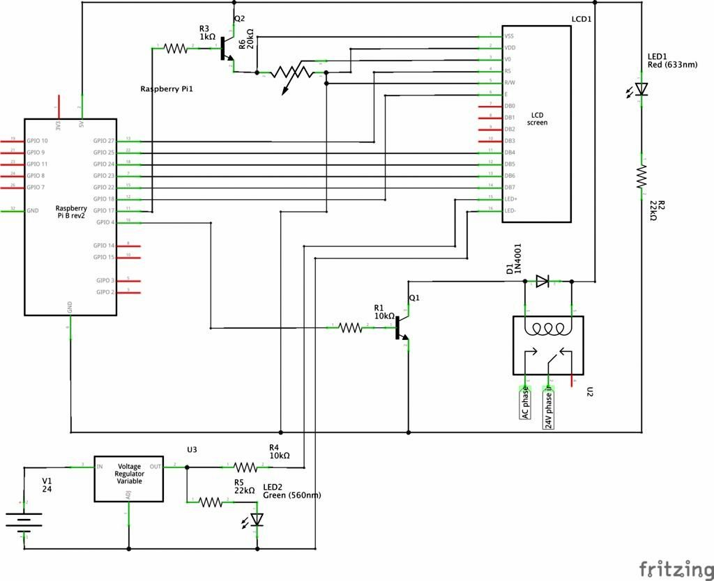

# qbee-gpio

[](https://github.com/gpajot/qbee-gpio/actions?query=workflow%3ATest+branch%3Amain+event%3Apush)
[](https://pypi.org/project/qbee-gpio/)
[](https://pypi.org/project/qbee-gpio/)

A python script to control an LCD and amplifier relay for use in an AirPlay Raspberry Pi server.

* Detect sound ouput and turn on the amplifier power supply.
* Get the track information and display it on an LCD (using a fifo pipe exposed by [shairport-sync](https://github.com/mikebrady/shairport-sync)).
* Auto turn off amplifier power supply and/or shutdown after set period of inactivity.

## Installation

```shell
python -m pip install --user qbee-gpio
````

For first time usage:
```shell
~/.local/bin/qbee --init-config
```
then change what you need in `~/.qbee.yaml`.

## Usage

```shell
~/.local/bin/qbee
```

Pass a `-v` flag for verbose logging.

## Detailed setup

### Setting up Hifiberry DAC

Edit `/boot/config.txt` to add:
```
dtparam=audio=on
dtoverlay=hifiberry-dac
```

To disable the built-in sound card, edit `/etc/modprobe.d/raspi-blacklist.conf` to add:
```
blacklist snd_bcm2835
```

Edit `/etc/asound.conf` to set the default sound card for alsa, add:
```
defaults.pcm.card 0
defaults.ctl.card 0
```

### Setting up shairport-sync

You can follow instructions [here](https://github.com/mikebrady/shairport-sync/blob/master/BUILD.md). Here is what I used.

Install required packages:
```shell
sudo apt install --no-install-recommends build-essential git autoconf automake libtool \
    libpopt-dev libconfig-dev libasound2-dev avahi-daemon libavahi-client-dev libssl-dev libsoxr-dev
```

Install shairport-sync:
```shell
git clone https://github.com/mikebrady/shairport-sync.git
cd shairport-sync
autoreconf -fi
./configure --sysconfdir=/etc --with-alsa --with-soxr --with-avahi --with-ssl=openssl --with-systemd --with-metadata
make
make install
cd ../ && rm -rf shairport-sync
```

Edit `/etc/shairport-sync.conf` file, uncomment the metadata block to enable:
```
metadata =
{
        enabled = "yes";
        include_cover_art = "no";
        pipe_name = "/tmp/shairport-sync-metadata";
        pipe_timeout = 5000;
};
```

Enable to run on boot: `sudo systemctl enable shairport-sync`.

### Qbee

For starting up automatically, create `/etc/systemd/system/qbee.service` file with (adjust users/paths):
```
[Unit]
Description=Qbee
After=network-online.target
StartLimitIntervalSec=500
StartLimitBurst=5

[Service]
User=qbee
Group=qbee
ExecStart=/home/qbee/.local/bin/qbee
Restart=on-failure
RestartSec=5s

[Install]
WantedBy=multi-user.target
```
Enable to run on boot: `sudo systemctl enable qbee`.

Optionally, specify a `CONFIG` env variable when running the script:
`CONFIG="/etc/qbee.yaml" ~/.local/bin/qbee ...`.
The default config will be located at `~/.qbee.yaml`.

See [all config options](./qbee_gpio/config.py)

### Disable Pi GPU

This should help give more power to the CPU, useful for older Pis.
Edit `/boot/config.txt` and add:
```
gpu_mem=16
disable_l2cache=0  # For pi 1 only
gpu_freq=250
```

### Full circuit diagram



The relay turns on the 24 VDC power supply, which powers the amplifier, the LCD backlight and a green status LED.
