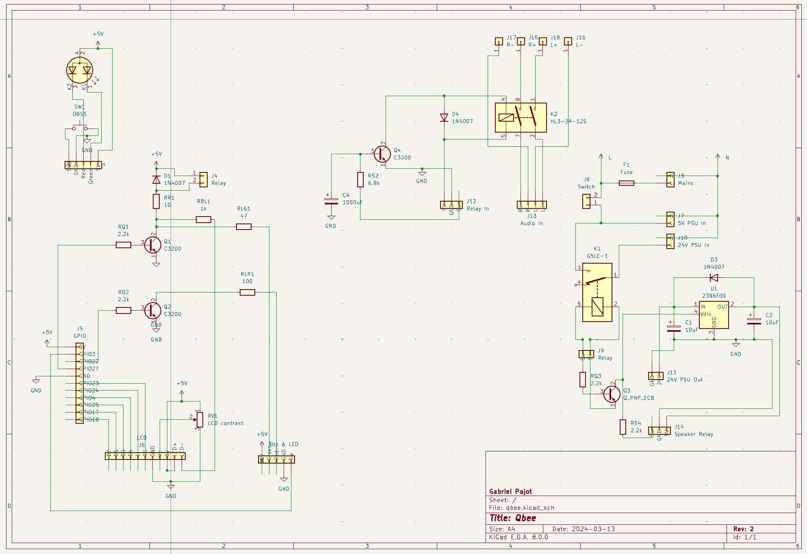

# My hardware

I am using the first Hifiberry DAC on a Raspberry Pi 1.
I have added circuits to:

* control the LCD, amplifier relay and a couple of status LEDs
* a push button to turn off the Pi or start it
* control a relay between speakers and amplifier (avoid startup plops)
* dispatch AC power.

## Setting up Hifiberry DAC

Edit `/boot/config.txt` to add:
```
dtoverlay=hifiberry-dac
```
and comment `dtparam=audio=on`.

To disable the built-in sound card, edit `/etc/modprobe.d/raspi-blacklist.conf` to add:
```
blacklist snd_bcm2835
```

Edit `/etc/asound.conf` to set the default sound card for alsa, add:
```
defaults.pcm.card 0
defaults.ctl.card 0
```

## Disable Pi GPU

This should help give more power to the CPU, useful for older Pis.
Edit `/boot/config.txt` and add:
```
gpu_mem=16
disable_l2cache=0  # For pi 1 only
gpu_freq=250
```

## Circuit schematic



Most of the GPIOs are used to control the LCD.
GPIO 3 is used for a one-button start and stop (add `dtoverlay=gpio-shutdown` in `/boot/config.txt`).
2 more GPIOs are used to trigger 2 NPN transistors (to limit power drawn on the GPIO and allow using a higher voltage):
- Q1:
  - the green on LED
  - the LCD backlight
  - the 24V PSU relay (power to the amplifier)
    - also fed to Q3 to control the 9V regulator that controls the speaker relay
    - Q4 is added before the speaker relay to delay on through a resistor + capacitor (avoid plops)
- Q2:
  - the red standby LED

Here is a [simulated version](https://www.falstad.com/circuit/circuitjs.html?ctz=CQAgjCAMB0l3BWEBmAHAJmgdgGzoRmACzICcpkORICkNIJNApgLRhgBQALisjiOlSoGqOoOF0IMBAnI5aRdkUgIi6LFGg4yyFXFJh0hnGFIM4IACZMAZgEMArgBsuHAE69+4z+FLoo4PCQHABuIKJ0CILhFnwSAcr0dMnQCBxgeDRE1NnCqtQIhgJWto4uLE5MlgFSmpCcHkSiAug5zer+kvAcAO4idMh8WdSD-MEZ-vkCWJPZPv7W9s5cFVXgASn16VjCOJDCGTRFh-xS0J2wRqhYYKKkaKhEMpkwKoFBm-7om2BIr2+caqFfzNPbCdolJYubg+Uj8RT8OE1EAsZDQIQzerIX5YZQGBDITQ4LAEvBEUg7HB+Aw5CyLMquDyjEBI5mmTr9ODuHzslCPXwcsBBGFoai8kj+XmSTQIPZNSCDPikWiyonoUhCVBgLCjQTIIzmOj05bchC4cDm+UWsbvcaZYmS81m07mhalZararSn4cAAeNAoAgsOBDQcJYv8ABkAMIAEQAOgBnABCdgAxgBrJwASwA5gALVz+2Vtfx7eGoJARkAAeQAdknIwBRWN+mg4YS6JDaTv7BjgfwAZS4djrlgARgBPRst7lW3L9FAdmrdJmQHJUBj6hibrrdMLNZntVXJcwoaCE0-SGESndtOhEXfrNhaLBv1C6b6KMjfA7YN87J+9QUlQyCsMIyhGu60J9FaUR5HM8FQL0wxHLMBTRMEsHNPOzRIVhqELvOTTIdhAzLrI-hxMhuYxD4h7LskKERDQ0RTPhzGxBRfhLhIKFWro94+ARUwdIuYkEVa6CtDEYgyQRLHSdQLHUcEtG3r+W5fPJpGLtq8LbvpukOtasmmQpFhKWZRnBP6GAaE8ECPBATw5AONAAGptvgAgajQSC6C57kAOIAAoAJI1hw6mHOw-gIgO8QiUUOGHM0yXxXkKVMX0YIiCAeXpShhV0CxRV9GVpUWDZ0WocyUzIFEGy1exbGIXszUkGIqr6pI0S9RsID2E4iZMCh+D8ANE13rp02PiM64zQR01idNUrjaqvJsjxwRAA) of Q1 and Q2.
Note that GPIO outputs have pull-down resistors so low is equivalent to ground.

As the ground of the 5V and 24V PSUs are linked between the amplifier and the DAC,
grounds should not be connected anywhere else to avoid creating a ground loop and introducing noise.